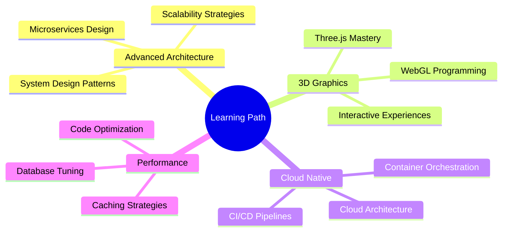

<!-- Banner with animated background -->
<div align="center">
  
</div>

<!-- Animated typing effect -->
<div align="center">
  
</div>

<!-- Social badges with hover effects -->
<div align="center">
  <a href="https://linkedin.com/in/zargham-abbas-dev/" target="_blank">
    
  </a>
  <a href="mailto:czaaaa20@gmail.com">
    
  </a>
  <a href="https://github.com/fastcode746" target="_blank">
    
  </a>
  <a href="https://instagram.com/zargham_746/" target="_blank">
    
  </a>
</div>

<!-- Profile views and location -->
<div align="center">
  
  
  
</div>

<br />

<!-- Quick Stats Cards -->
<div align="center">
  <table>
    <tr>
      <td align="center" width="25%">
        
        <br />
        <strong>40+</strong>
        <br />
        <sub>Projects Delivered</sub>
      </td>
      <td align="center" width="25%">
        
        <br />
        <strong>4+</strong>
        <br />
        <sub>Years Experience</sub>
      </td>
      <td align="center" width="25%">
        
        <br />
        <strong>Global</strong>
        <br />
        <sub>Client Base</sub>
      </td>
      <td align="center" width="25%">
        
        <br />
        <strong>5.0⭐</strong>
        <br />
        <sub>Client Rating</sub>
      </td>
    </tr>
  </table>
</div>

<br />

<!-- About Me Section with gradient -->


##  About Me

```javascript
const zargham = {
    title: "Full Stack Developer & Software Engineer",
    location: "Jhelum, Punjab, Pakistan 🇵🇰",
    company: "Direct2Success Ltd",
    specialization: ["MERN Stack", "Flutter", "Laravel"],
    currentFocus: "Building Scalable SAAS Solutions",
    
    experience: {
        mobile: "4+ years",
        web: "2+ years",
        freelance: "40+ global projects"
    },
    
    currentlyLearning: [
        "Three.js & WebGL",
        "Advanced System Architecture",
        "Microservices Design Patterns"
    ],
    
    askMeAbout: [
        "MERN Stack Development",
        "Flutter Mobile Apps",
        "API Architecture",
        "SAAS Solutions"
    ],
    
    funFact: "I code less and clone more! 🚀 (Smart work > Hard work)",
    availability: "Open for Full-Time & Freelance Opportunities"
};
```


##  Technical Arsenal

### 🎯 Languages & Core Technologies
<div align="center">
  


</div>

### 🎨 Frontend Development
<div align="center">


</div>

### ⚙️ Backend Development
<div align="center">


</div>

### 🗄️ Databases & Storage
<div align="center">


</div>

### ☁️ DevOps & Cloud
<div align="center">


</div>

### 🛠️ Tools & Platforms
<div align="center">


</div>


##  Professional Journey

<details open>
<summary><b>🏢 Full Stack Web Developer @ Direct2Success Ltd</b></summary>
<br>

> **📅 April 2024 - Present | Islamabad, Pakistan**

```typescript
const achievements = {
    platform: "Real-Time SAAS E-commerce Application",
    stack: "MERN (MongoDB, Express, React, Node.js)",
    
    keyResults: [
        "⚡ Optimized API performance by 40% through caching strategies",
        "🎨 Revamped UI achieving 35% increase in user engagement",
        "🔄 Implemented real-time features using WebSockets",
        "💳 Integrated payment gateways and inventory management",
        "📊 Built analytics dashboards for business insights",
        "🚀 Maintained 99.9% uptime for production systems"
    ],
    
    collaboration: "Close stakeholder engagement for feature development"
};
```

</details>

<details>
<summary><b>📱 Flutter Engineer @ Fastcode Solutions Inc</b></summary>
<br>

> **📅 February 2022 - June 2023 | Islamabad, Pakistan**

```dart
class FlutterExperience {
  final String role = 'Flutter Engineer';
  
  List<String> accomplishments = [
    '📱 Built & maintained 20+ mobile applications',
    '🎯 Achieved 95% on-time project delivery',
    '👥 Mentored junior developers on best practices',
    '🏗️ Implemented clean architecture patterns',
    '🔥 Integrated Firebase for real-time features',
    '🛒 Developed e-commerce apps with payment integration'
  ];
  
  String methodology = 'Agile/Scrum';
  String environment = 'Fast-paced client-based';
}
```

</details>

<details>
<summary><b>💼 Freelance Full Stack Developer</b></summary>
<br>

> **📅 2020 - Present | Remote (Global Clients)**

```python
class FreelanceSuccess:
    def __init__(self):
        self.projects_completed = 40+
        self.client_rating = 5.0
        self.client_base = "International"
        
    def services_offered(self):
        return [
            "🌐 Full-stack web application development",
            "📱 Cross-platform mobile app development",
            "🛒 E-commerce solutions with payment integration",
            "🔧 API development and integration",
            "🎨 UI/UX design and implementation",
            "☁️ Cloud deployment and DevOps"
        ]
    
    def success_factors(self):
        return {
            "quality": "Exceptional code quality",
            "communication": "Clear & timely updates",
            "delivery": "On-time project completion"
        }
```

</details>


##  Featured Projects

<div align="center">

<table>
<tr>
<td width="50%">

### 🛒 DesignPrint NYC Admin
**SAAS E-commerce Platform**

[](https://admin.designprintnyc.com)

**Tech Stack:**
- MongoDB | Express | React | Node.js
- Redux | TailwindCSS | Socket.io

**Features:**
- 🎯 Multi-tenant architecture
- 📊 Real-time analytics dashboard
- 🔐 Role-based access control
- 📈 Automated reporting system
- 📱 Fully mobile responsive

</td>
<td width="50%">

### 🌾 Zaraat Mobile App
**Agricultural Marketplace MVP**

[](https://www.linkedin.com/posts/zargham-abbas-dev_flutter-ai-flutterdeveloper-activity-7363858338423390208-sX2M?utm_source=share&utm_medium=member_desktop&rcm=ACoAAFXNX-UBSPIdRuD2mfwwK8NWOlal5JR_3m8)

**Tech Stack:**
- Flutter | Firebase | Dart
- Google Maps API | Stripe

**Features:**
- 🗺️ Geolocation services
- 💬 In-app messaging
- 💳 Secure payment integration
- 📸 Product image upload
- 🌍 Connect farmers & buyers

</td>
</tr>

<tr>
<td width="50%">

### 🎨 3D Interactive Portfolio
**Immersive Web Experience**

[](https://zarghamabbas-portfolio.vercel.app/)

**Tech Stack:**
- React | Three.js | TypeScript
- WebGL | GSAP

**Features:**
- 🎮 3D Windows environment
- ✨ Smooth animations
- 🖱️ Interactive elements
- 🎯 Responsive design
- ⚡ Optimized performance

</td>
<td width="50%">

### 💼 Other Notable Work
**Diverse Project Portfolio**

**Achievements:**
- 🛍️ 10+ E-commerce platforms
- 🎓 15+ Student FYP projects
- 💬 Real-time chat applications
- 🔌 RESTful & GraphQL APIs
- 📊 Data visualization dashboards
- 🔄 100k+ daily API requests

</td>
</tr>
</table>

</div>


## 📊 GitHub Analytics

<div align="center">
  
  
</div>

<div align="center">
  
</div>


## 🎓 Education & Recognition

<table>
<tr>
<td width="60%">

### 🎯 Bachelor of Science in Software Engineering
**University of Sargodha, Pakistan**
- 📅 2021 - 2025
- 📊 CGPA: 3.45/4.0
- 🏆 Strong foundation in Computer Science fundamentals

</td>
<td width="40%">

### 🏅 Leadership & Achievements
- 👨‍💼 **President**, Technical Wing - SE Spectrum
- 👨‍🏫 **Workshop Tutor** - Flutter Development
- 🎤 **Guest Speaker** - Mobile Development Sessions
- 📈 **40+ Projects** Successfully Delivered

</td>
</tr>
</table>


## 🚀 Current Focus

<div align="center">



</div>


## 🤝 Let's Build Something Amazing Together!

<div align="center">

### 💼 I'm Available For

<table>
<tr>
<td align="center" width="33%">

<br />
<strong>Full-Time Roles</strong>
<br />
<sub>Software Engineer<br/>Full Stack Developer</sub>
</td>
<td align="center" width="33%">

<br />
<strong>Freelance Projects</strong>
<br />
<sub>Web & Mobile Apps<br/>SAAS Solutions</sub>
</td>
<td align="center" width="33%">

<br />
<strong>Mentorship</strong>
<br />
<sub>Code Reviews<br/>Technical Guidance</sub>
</td>
</tr>
</table>

### 💬 Ask Me About


### 📬 Reach Out!

<a href="https://linkedin.com/in/zargham-abbas-dev/">
  
</a>
<a href="mailto:czaaaa20@gmail.com">
  
</a>
<a href="https://github.com/fastcode746">
  
</a>

<br/><br/>

### 💙 Thanks for visiting! Let's create something extraordinary!


</div>

---

<div align="center">
  <sub>✨ Crafted with passion by <a href="https://github.com/fastcode746">Zargham Abbas</a> | ⭐ Star my repos if you find them useful!</sub>
  
  <br/><br/>
  
  
  
  
</div>

---

<div align="center">
  <details>
    <summary><b>📍 Important Note</b></summary>
    <br/>
    <i>Most of my repositories are private to maintain client confidentiality and protect proprietary code. The public repos showcase personal projects and open-source contributions.</i>
  </details>
</div>

<!-- Wave footer -->

